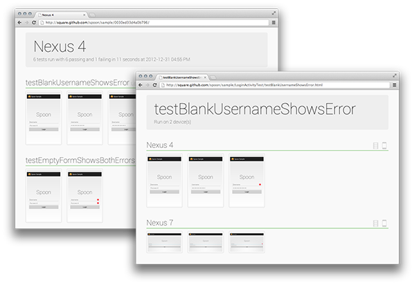
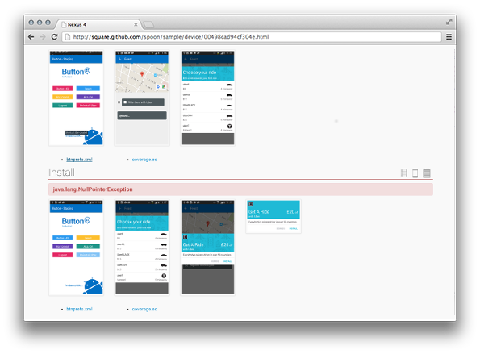
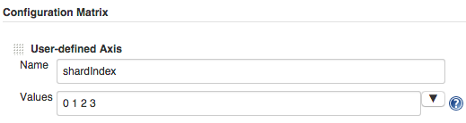
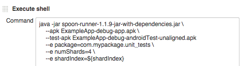

Spoon
=====

Distributing instrumentation tests to all your Androids.


Introduction
------------

Android's ever-expanding ecosystem of devices creates a unique challenge to
testing applications. Spoon aims to simplify this task by distributing
instrumentation test execution and displaying the results in a meaningful way.

Instead of attempting to be a new form of testing, Spoon makes existing
instrumentation tests more useful. Using the application APK and instrumentation
APK, Spoon runs the tests on multiple devices simultaneously. Once all tests
have completed a static HTML summary is generated with detailed information
about each device and test.


Spoon will run on all targets which are visible to `adb devices`. Plug in
multiple different phones and tablets, start different configurations of
emulators, or use some combination of both!

The greater diversity of the targets in use, the more useful the output will be
in visualizing your applications.


Screenshots
-----------

In addition to simply running instrumentation tests, Spoon has the ability to
snap screenshots at key points during your tests which are then included in the
output. This allows for visual inspection of test executions across different
devices.

Taking screenshots requires that you include the `spoon-client` JAR in your
instrumentation app. For Spoon to save screenshots your app must have the
`WRITE_EXTERNAL_STORAGE` permission. In your tests call the `screenshot`
method with a human-readable tag.

```java
Spoon.screenshot(activity, "initial_state");
/* Normal test code... */
Spoon.screenshot(activity, "after_login");
```

The tag specified will be used to identify and compare screenshots taken across
multiple test runs.



You can also view each test's screenshots as an animated GIF to gauge the actual
sequence of interaction.


Files
-----
If you have files that will help you in debugging or auditing a test run, for example a log file or a SQLite database
you can save these files easily and have them attached to your test report.
This will let you easily drill down any issues that occurred in your test run.

Attaching files to your report requires that you include the `spoon-client` jar and that you have `WRITE_EXTERNAL_STORAGE`
permission.

```java
// by absolute path string
Spoon.save(context, "/data/data/com.yourapp/your.file");
// or with File
Spoon.save(context, new File(context.getCacheDir(), "my-database.db"));
```



You download the files by clicking on the filename in the device report.

Download
--------

Download the [latest runner JAR][1] or the [latest client JAR][2], or just add to your dependencies:

Maven:
```xml
<dependency>
  <groupId>com.squareup.spoon</groupId>
  <artifactId>spoon-client</artifactId>
  <version>1.3.1</version>
</dependency>
```

Gradle:
We recommend using the [gradle plugin][3] (currently maintained as a separate project).

Snapshots of the development version are available in [Sonatype's `snapshots` repository][snap].


Execution
---------

Spoon was designed to be run both as a standalone tool or directly as part of
your build system.

You can run Spoon as a standalone tool with your application and instrumentation
APKs.

```
java -jar spoon-runner-1.3.1-jar-with-dependencies.jar \
    --apk ExampleApp-debug.apk \
    --test-apk ExampleApp-debug-androidTest-unaligned.apk
```

By default the output will be placed in a spoon-output/ folder of the current
directory. You can control additional parameters of the execution using other
flags.

```
Options:
    --apk               Application APK
    --output            Output path
    --sdk               Path to Android SDK
    --test-apk          Test application APK
    --title             Execution title
    --class-name        Test class name to run (fully-qualified)
    --method-name       Test method name to run (must also use --class-name)
    --no-animations     Disable animated gif generation
    --size              Only run test methods annotated by testSize (small, medium, large)
    --adb-timeout       Set maximum execution time per test in seconds (10min default)
    --fail-on-failure   Non-zero exit code on failure
    --coverage          Code coverage flag. For Spoon to calculate coverage file your app must have the `WRITE_EXTERNAL_STORAGE` permission.
                        (This option pulls the coverage file from all devices and merge them into a single file `merged-coverage.ec`.)
    --fail-if-no-device-connected Fail if no device is connected
    --sequential        Execute the tests device by device
    --init-script       Path to a script that you want to run before each device
    --grant-all         Grant all runtime permissions during installation on Marshmallow and above devices
    --e                 Arguments to pass to the Instrumentation Runner. This can be used
                        multiple times for multiple entries. Usage: --e <NAME>=<VALUE>.
                        The supported arguments varies depending on which test runner 
                        you are using, e.g. see the API docs for AndroidJUnitRunner.
```

If you are using Maven for compilation, a plugin is provided for easy execution.
Declare the plugin in the `pom.xml` for the instrumentation test module.

```xml
<plugin>
  <groupId>com.squareup.spoon</groupId>
  <artifactId>spoon-maven-plugin</artifactId>
  <version>1.3.1</version>
</plugin>
```

The plugin will look for an `apk` dependency for the corresponding application.
Typically this is specified in parallel with the `jar` dependency on the
application.

```xml
<dependency>
  <groupId>com.example</groupId>
  <artifactId>example-app</artifactId>
  <version>${project.version}</version>
  <type>jar</type>
  <scope>provided</scope>
</dependency>
<dependency>
  <groupId>com.example</groupId>
  <artifactId>example-app</artifactId>
  <version>${project.version}</version>
  <type>apk</type>
  <scope>provided</scope>
</dependency>
```

You can invoke the plugin by running `mvn spoon:run`. The execution result will
be placed in the `target/spoon-output/` folder.  If you want to specify a test
class to run, add `-Dspoon.test.class=fully.qualified.ClassName`.  If you only
want to run a single test in that class, add `-Dspoon.test.method=testAllTheThings`.

For a working example see the sample application and instrumentation tests in
the `spoon-sample/` folder.

Test Sharding
-------------

The Android Instrumentation runner supports test sharding using the `numShards` and `shardIndex` arguments ([documentation](https://developer.android.com/tools/testing-support-library/index.html#ajur-sharding)).  

If you are specifying serials for multiple devices, you may use spoon's built in auto-sharding by specifying --shard:

```
java -jar spoon-runner-1.3.1-jar-with-dependencies.jar \
    --apk ExampleApp-debug.apk \
    --test-apk ExampleApp-debug-androidTest-unaligned.apk \
    -serial emulator-1 \
    -serial emulator-2 \
    --shard
```

This will automatically shard across all specified serials, and merge the results. When this option is running with `--coverage` flag. It will merge all the coverage files generated from all devices into a single file called `merged-coverage.ec`.

If you'd like to use a different sharding strategy, you can use the `--e` option with Spoon to pass those arguments through to the instrumentation runner, e.g.

```
java -jar spoon-runner-1.3.1-jar-with-dependencies.jar \
    --apk ExampleApp-debug.apk \
    --test-apk ExampleApp-debug-androidTest-unaligned.apk \
    --e numShards=4 \
    --e shardIndex=0
```
However, it will be up to you to merge the output from the shards.


If you use Jenkins, a good way to set up sharding is inside a "Multi-configuration project".

 - Add a "User-defined Axis".  Choose a name for the shard index variable, and define the index values you want (starting at zero).

   

 - In your "Execute shell" step, use the same execution command as above, but inject the shard index for each slave node using the variable you defined above, e.g. `--e shardIndex=${shard_index}`.  Make sure you're passing in the correct total number of shards too, e.g. `--e numShards=4`.

   


Running Specific Tests
----------------------

There are numerous ways to run a specific test, or set of tests.  You can use the Spoon `--size`, `--class-name` or `--method-name` options, or you can use the `--e` option to pass arguments to the instrumentation runner, e.g.

```
    --e package=com.mypackage.unit_tests
```
See the documentation for your instrumentation runner to find the full list of supported options (e.g. [AndroidJUnitRunner](http://developer.android.com/reference/android/support/test/runner/AndroidJUnitRunner.html)).


License
--------

    Copyright 2013 Square, Inc.

    Licensed under the Apache License, Version 2.0 (the "License");
    you may not use this file except in compliance with the License.
    You may obtain a copy of the License at

       http://www.apache.org/licenses/LICENSE-2.0

    Unless required by applicable law or agreed to in writing, software
    distributed under the License is distributed on an "AS IS" BASIS,
    WITHOUT WARRANTIES OR CONDITIONS OF ANY KIND, either express or implied.
    See the License for the specific language governing permissions and
    limitations under the License.


 [1]: https://search.maven.org/remote_content?g=com.squareup.spoon&a=spoon-runner&v=LATEST&c=jar-with-dependencies
 [2]: https://search.maven.org/remote_content?g=com.squareup.spoon&a=spoon-client&v=LATEST
 [3]: https://github.com/stanfy/spoon-gradle-plugin
 [snap]: https://oss.sonatype.org/content/repositories/snapshots/

